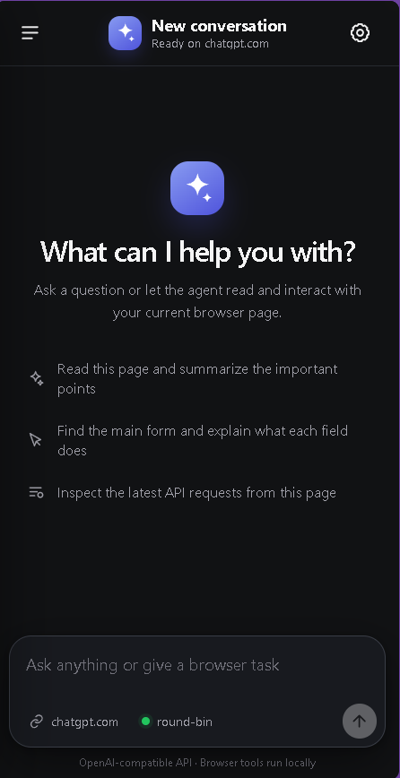
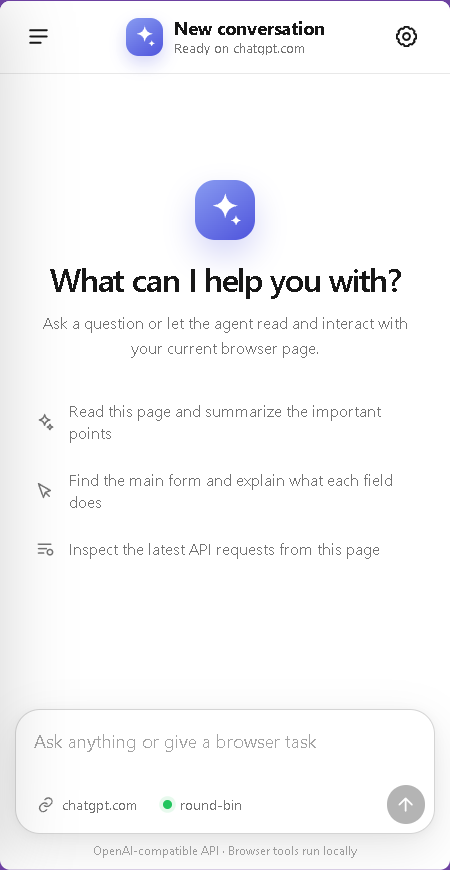
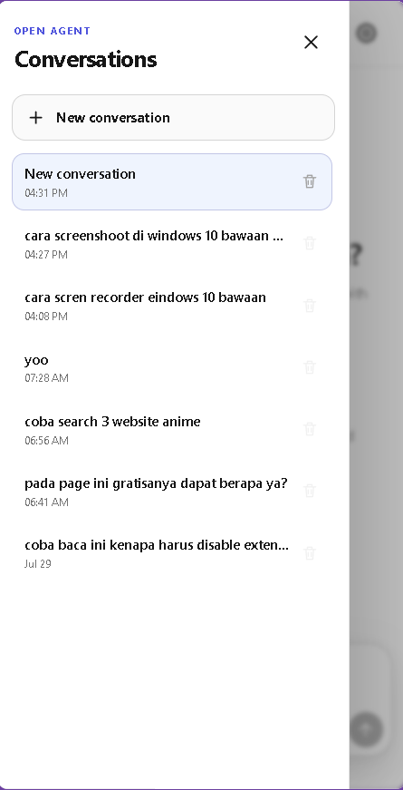
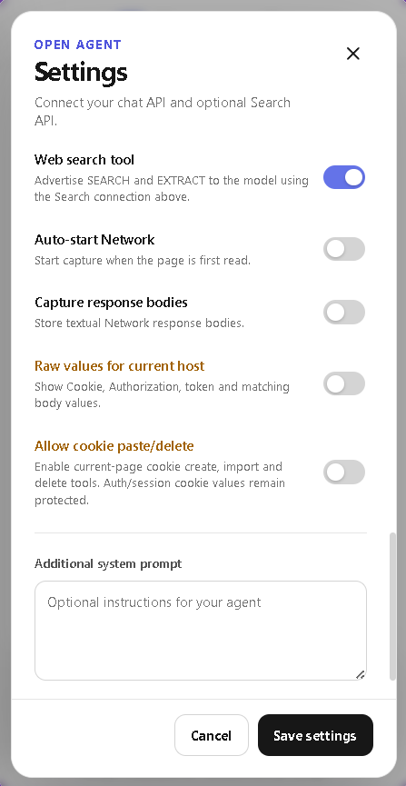

<p align="center">
  
</p>

<h1 align="center">Open Browser Agent</h1>

<p align="center">
  <strong>Bring your own model. Let it work inside your browser.</strong><br>
  A clean-source Chrome side-panel agent for reading pages, operating interfaces, inspecting network traffic, managing cookies, and researching the web.
</p>

<p align="center">
  <a href="#-core-features">Core Features</a> •
  <a href="#-built-in-tools">Built-in Tools</a> •
  <a href="#-quick-start">Quick Start</a> •
  <a href="#-configuration">Configuration</a> •
  <a href="#-privacy--security">Privacy & Security</a>
</p>

<p align="center">
  
  
  
  
  
</p>

<table align="center">
  <tr>
    <td align="center"></td>
    <td align="center"></td>
    <td align="center"></td>
    <td align="center"></td>
  </tr>
</table>

---

## Open AI, directly in the browser

Open Browser Agent turns Chrome's side panel into an AI workspace that can understand the active page and take verified actions through native browser tools. Connect any compatible chat endpoint, keep control of sensitive capabilities, and inspect every agent step as it runs.

## ✨ Core Features

- **Bring your own model** — Connect any OpenAI-compatible API and configure the model, temperature, prompt, streaming, and tool limits.
- **Browser automation** — Read pages, click, fill forms, navigate, switch tabs, scroll, press keys, and run JavaScript.
- **Live agent activity** — View provider reasoning, tool calls, results, and execution status in real time.
- **Mid-run steering** — Add new instructions while the agent is still working.
- **Network inspection** — Capture and filter requests, headers, payloads, status data, and response bodies.
- **Cookie tools** — View, export, create, import, update, or delete current-page cookies.
- **Web search and extraction** — Use SEARCH and EXTRACT through direct or 9Router-compatible endpoints.
- **Context compaction** — Keep full chats locally while sending compact context to the model.
- **Multiple conversations** — Create, switch, auto-title, save, and delete chats.
- **Rich response rendering** — Stream Markdown, highlighted code, copy buttons, and scrollable tables.
- **Light and dark themes** — Use system, light, or dark appearance.
- **Self-contained source** — No install-time or runtime package dependencies, bundling, or obfuscation; the pinned JavaScript parser is vendored with its license and provenance.

## 🧰 Built-in Tools

| Area | Tools | Capability |
| --- | --- | --- |
| Page understanding | `read_page` | Returns visible text and interactive elements with stable references. |
| Interaction | `click`, `fill`, `select_option`, `press_key` | Operates forms and page controls through element references. |
| Navigation | `scroll_page`, `wait`, `navigate` | Handles long pages, asynchronous updates, and HTTP/HTTPS navigation. |
| Tabs | `list_tabs`, `switch_tab` | Finds and changes the active agent target within the current window. |
| Advanced page access | `executeScript` | Runs JavaScript in the page's main world for complex DOM or runtime tasks. |
| Network debugging | `network_start`, `network_get`, `network_clear`, `network_stop` | Captures and inspects recent DevTools Network activity. |
| Cookie debugging | `cookies_list`, `cookies_set`, `cookies_import`, `cookies_delete`, `cookies_delete_all` | Reads, exports, writes, imports, or removes current-page cookies. |
| Web research | `web_search_tool` | Uses `SEARCH` for discovery and `EXTRACT` for known URLs. |

Search and cookie-write tools are not advertised to the model until their corresponding switches are enabled.

## 🚀 Quick Start

1. Download or clone this repository.
2. Open `chrome://extensions`.
3. Enable **Developer mode**.
4. Select **Load unpacked** and choose the project folder.
5. Reload any browser tabs that were already open.
6. Open the side panel, go to **Settings**, and enter your API configuration.

Use the extension button or press `Ctrl+M` on Windows/Linux and `Command+M` on macOS.

### Minimum chat configuration

```text
Base URL: https://api.openai.com/v1
API key:  <your key>
Model:    <tool-capable model>
```

The extension sends requests to:

```text
POST <base-url>/chat/completions
Authorization: Bearer <api-key>
```

## ⚙️ Configuration

### Chat Connection

Configure the Base URL, API key, model, temperature, tool-step limit, streaming, and additional system prompt.

Supports JSON, SSE, NDJSON, reasoning fields, streamed tool calls, and common proxy response formats.

### Search Connection

Enable **Web search tool**, then choose:

- **Direct endpoints** — Separate Search and Fetch URLs.
- **9Router-compatible** — One base URL for `/search` and `/web/fetch`.

Search and Fetch support separate keys and models. Search provides Web or News results, while Fetch returns Markdown, text, or HTML.

### Browser Tool Controls

- **Network capture (current tab)** — Turn capture on or off manually. Reading a page never starts it automatically.
- **Capture response bodies** — Save textual responses for inspection while capture is active.
- **Raw values for current host** — Reveal sensitive values only for the active host.
- **Allow cookie paste/delete** — Enable cookie write and management tools.

## 🧠 Context and Agent Behavior

Full conversations stay stored locally. For long chats, older messages are compacted into memory while recent turns remain unchanged.

New instructions can be added during an active run. The agent applies them at safe points and replans when necessary.

## 🔐 Privacy & Security

- Conversations, settings, memory, and themes are stored in the local Chrome profile.
- API credentials are encrypted with AES-256-GCM.
- Sensitive Network values are hidden by default.
- Cookie write tools require explicit activation.
- Only provider-supplied reasoning text is displayed.
- Data used by the agent may be sent to your configured API endpoints.

The extension requires broad browser permissions for automation and debugging. Use it only on pages and accounts you are authorized to access.

## 🧪 Development

No build step or package installation is required. Load the source folder directly as an unpacked extension. The Acorn parser is pinned under `vendor/acorn/`; see `THIRD_PARTY_NOTICES.md`.

Node.js is used only as the local test runner. Run the regression checks with:

```bash
npm run check
```

The test suite covers credential storage, browser-agent behavior, context compaction, human-in-the-loop steering, shared debugger ownership, manual Network toggling, parser behavior, and zero-dependency packaging.

## 📄 License

Licensed under the [GPL-3.0 License](LICENSE). Vendored third-party notices are listed in [THIRD_PARTY_NOTICES.md](THIRD_PARTY_NOTICES.md).
