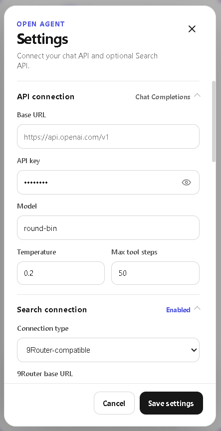
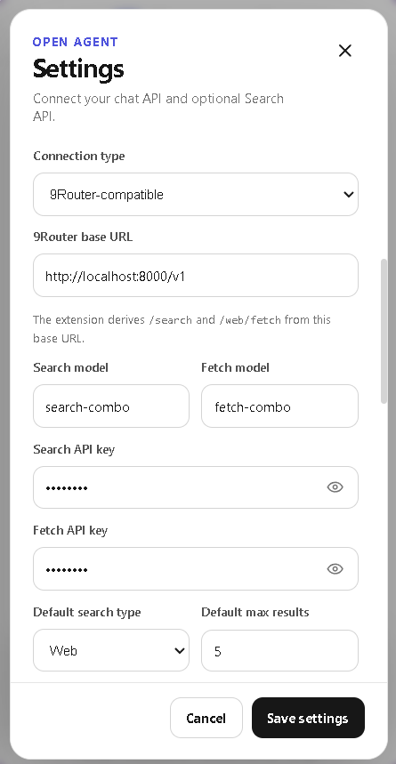

<p align="center">
  
</p>

<h1 align="center">Open Browser Agent</h1>

<p align="center">
  <strong>Bring your own model. Let it work inside your browser.</strong><br>
  A clean-source Chrome side-panel agent for reading pages, operating interfaces, inspecting network traffic, managing cookies, and researching the web.
</p>

<p align="center">
  <a href="#-core-features">Core Features</a> •
  <a href="#-built-in-tools">Built-in Tools</a> •
  <a href="#-quick-start">Quick Start</a> •
  <a href="#-configuration">Configuration</a> •
  <a href="#-privacy--security">Privacy & Security</a>
</p>

<p align="center">
  
  
  
  
  
</p>

<table align="center">
  <tr>
    <td align="center"><br><sub><b>Dark Theme</b></sub></td>
    <td align="center"><br><sub><b>Light Theme</b></sub></td>
    <td align="center"><br><sub><b>Conversations</b></sub></td>
    <td align="center"><br><sub><b>Bring Your Own Model</b></sub></td>
    <td align="center"><br><sub><b>Search Connections</b></sub></td>
    <td align="center"><br><sub><b>Tool Controls</b></sub></td>
  </tr>
</table>

---

## Open AI, directly in the browser

Open Browser Agent turns Chrome's side panel into an AI workspace that can understand the active page and take verified actions through native browser tools. Connect any compatible chat endpoint, keep control of sensitive capabilities, and inspect every agent step as it runs.

## ✨ Core Features

- **Bring your own model** — Connect any OpenAI-compatible `POST /chat/completions` endpoint and choose the model, temperature, system prompt, streaming mode, and tool-step limit.
- **Real browser operation** — Read pages, click elements, fill forms, choose options, press keys, scroll, navigate, switch tabs, wait for updates, and execute JavaScript in the page's main world.
- **Transparent agent execution** — Follow live thinking fields supplied by the provider, ordered tool calls, arguments, concise results, and Running, Done, Failed, or Stopped states.
- **Steer active runs** — Send a new instruction while the agent is working. Pending actions are safely skipped when needed, then the agent replans around the latest request.
- **Developer-grade Network inspection** — Capture requests through Chrome DevTools Protocol, filter by URL, method, or resource type, and inspect headers, payloads, status data, and optional textual response bodies.
- **Advanced cookie debugging** — List and export current-page cookies, including HttpOnly values. Optional write tools can create, import, update, delete, or clear cookies after explicit enablement.
- **Web research without unnecessary navigation** — Add `SEARCH` and `EXTRACT` through direct endpoints or a 9Router-compatible connection, with separate search/fetch models, keys, formats, and result limits.
- **Long-chat context control** — Keep the complete conversation locally while rolling compaction sends a compact memory plus recent turns to the model.
- **Local conversation workspace** — Create, switch, auto-title, preserve, and delete multiple conversations from the side panel.
- **Polished response rendering** — Stream answers incrementally with Markdown, syntax-highlighted code blocks, language labels, copy buttons, and scrollable tables.
- **System, light, and dark themes** — Match the browser automatically or choose a fixed appearance.
- **Clean, auditable source** — Dependency-free HTML, CSS, and JavaScript with no bundler, minification, or obfuscated production output.

## 🧰 Built-in Tools

| Area | Tools | Capability |
| --- | --- | --- |
| Page understanding | `read_page` | Returns visible text and interactive elements with stable references. |
| Interaction | `click`, `fill`, `select_option`, `press_key` | Operates forms and page controls through element references. |
| Navigation | `scroll_page`, `wait`, `navigate` | Handles long pages, asynchronous updates, and HTTP/HTTPS navigation. |
| Tabs | `list_tabs`, `switch_tab` | Finds and changes the active agent target within the current window. |
| Advanced page access | `executeScript` | Runs JavaScript in the page's main world for complex DOM or runtime tasks. |
| Network debugging | `network_start`, `network_get`, `network_clear`, `network_stop` | Captures and inspects recent DevTools Network activity. |
| Cookie debugging | `cookies_list`, `cookies_set`, `cookies_import`, `cookies_delete`, `cookies_delete_all` | Reads, exports, writes, imports, or removes current-page cookies. |
| Web research | `web_search_tool` | Uses `SEARCH` for discovery and `EXTRACT` for known URLs. |

Search and cookie-write tools are not advertised to the model until their corresponding switches are enabled.

## 🚀 Quick Start

1. Download or clone this repository.
2. Open `chrome://extensions`.
3. Enable **Developer mode**.
4. Select **Load unpacked** and choose the project folder.
5. Reload any browser tabs that were already open.
6. Open the side panel, go to **Settings**, and enter your API configuration.

Use the extension button or press `Ctrl+M` on Windows/Linux and `Command+M` on macOS.

### Minimum chat configuration

```text
Base URL: https://api.openai.com/v1
API key:  <your key>
Model:    <tool-capable model>
```

The extension sends requests to:

```text
POST <base-url>/chat/completions
Authorization: Bearer <api-key>
```

## ⚙️ Configuration

### Chat connection

Configure the Base URL, API key, model, temperature, maximum tool steps, response streaming, and an optional additional system prompt.

The response parser supports standard JSON, OpenAI-style SSE, NDJSON, reasoning fields, streamed tool calls, BOM-prefixed payloads, control bytes, and common proxy envelopes.

### Search connection

Enable **Web search tool**, then choose one connection mode:

- **Direct endpoints** — Provide separate Search and Fetch URLs.
- **9Router-compatible** — Provide one base URL; the extension derives `/search` and `/web/fetch`.

Search and Fetch can use separate API keys and models. Search supports Web or News mode with 1–10 results. Fetch can request Markdown, text, or HTML.

### Browser tool controls

- **Auto-start Network** — Begin capture when a page is first read.
- **Capture response bodies** — Store textual response bodies for inspection.
- **Raw values for current host** — Reveal matching Cookie, Authorization, token, and body values only for the active host.
- **Allow cookie paste/delete** — Enable cookie write, import, and delete tools.

## 🧠 Context and Agent Behavior

Long conversations remain complete in local history. When model-facing context becomes large, older completed turns are summarized into per-conversation memory while recent messages remain verbatim. If compaction is unsupported or fails, the run falls back without blocking the conversation.

During an active run, new user instructions are queued and applied at safe boundaries. Completed actions remain checkpoints; unfinished tool calls can be skipped so the model can replan instead of blindly continuing an outdated plan.

## 🔐 Privacy & Security

- Settings, conversations, compacted memory, and appearance are stored in the local Chrome profile.
- API credentials are encrypted with AES-256-GCM. Ciphertext is stored in `chrome.storage.local`; the non-extractable encryption key is stored in extension IndexedDB.
- Credential values are redacted from agent events and error output where possible.
- Sensitive Network values remain hidden by default and require an explicit current-host switch.
- Cookie write tools require explicit opt-in.
- The extension only displays reasoning or thinking text returned by the configured provider. It does not extract hidden model reasoning.

Prompts, selected page content, tool results, search queries, fetched URLs, cookies requested by the user, and captured Network data may be sent to the endpoints you configure. Review the provider's privacy policy and enable sensitive tools only when needed.

This extension requires broad browser permissions because its core purpose is page automation and debugging. Use it only on pages and accounts you are authorized to inspect or control.

## 🧪 Development

No build step is required. Load the source folder directly as an unpacked extension.

Run the regression checks with:

```bash
npm run check
```

The test suite covers credential storage, browser-agent behavior, context compaction, and human-in-the-loop steering.

## 📄 License

Licensed under the [GPL-3.0 License](LICENSE).
